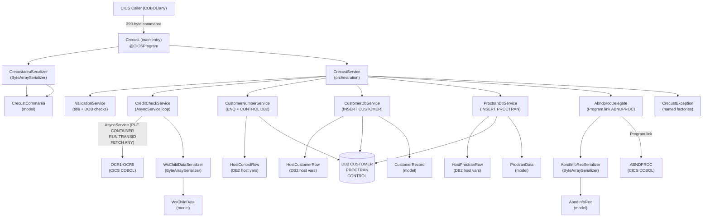

# Architecture — CRECUST Java Modernisation

## 1. Context and Scope

`CRECUST` is a CICS-linked Enterprise COBOL program that creates a new bank customer record.
It receives a 399-byte `DFHCOMMAREA` from a calling CICS transaction, validates customer data,
performs an asynchronous multi-agency credit-score check via the JCICS `AsyncService` API,
allocates a sequential customer number protected by a CICS Named Counter ENQ/DEQ, inserts the
customer row into the DB2 `CUSTOMER` table, writes an audit record to `PROCTRAN`, and returns
success or a fail-code through the same commarea.

The modernised Java program runs under the **JCICS JVM server** in CICS Transaction Server.
It preserves every external contract: the 399-byte commarea byte layout, the five OCR1–OCR5
COBOL credit-check transactions (unchanged), and the ABNDPROC COBOL abend handler (unchanged).

---

## 2. Paradigm and Runtime Target

**Paradigm:** CICS-linked service program (request–response, single CICS task per invocation).

**Runtime:** JCICS JVM server — no Spring Boot, no Liberty, no dependency injection framework.
All CICS API access is via `com.ibm.cics.server.*`. DB2 access is via plain JDBC with JNDI
`DataSource` lookup (raw JVM server compatible; no `@Resource` injection).

---

## 3. Architecture Diagram



---

## 4. Architectural Decisions (ADRs)

### ADR-1 — Serialization Strategy: ADR-A (Retain z/OS I/O)

**Status:** ADOPTED (mandated by Product Owner decision and PRD SER-1)

**Context:** The modernised program runs under JCICS and exchanges fixed-width EBCDIC byte-array
commareas with CICS callers (OCR1–OCR5, ABNDPROC, and any arbitrary CICS caller). The byte
layout must be preserved exactly.

**Decision:** ADR-A — retain z/OS I/O with JZOS-style serialization.

**Binds:** Every model class that maps to a byte-array interface must implement
`ByteArraySerializable<Self>`. Every such class has exactly one paired canonical
`ByteArraySerializer<T>` class. The three canonical serializers are:
`CrecustareaSerializer` (399 bytes), `WsChildDataSerializer` (399 bytes),
`AbndInfoRecSerializer` (≈673 bytes).

**Prevents:** Inline byte-packing in service classes; duplicate offset arithmetic across classes;
any omission of serializer classes for the three external byte-array contracts.

**Rule:** A canonical serializer is the single source of truth for its layout. All service
classes delegate; none re-implement byte writes.

**Consequences (from cobol-to-java-transform-rules rule 5 / rule 15):**
- Infrastructure interfaces `ByteArraySerializer<T>`, `ByteArraySerializable<T>`, `Settable<T>`,
  and utility class `Lists` are required project dependencies.
- A shared layout-constants class (e.g., `CrecustareaLayout`) holds all field offsets and
  widths; no constant is redeclared in the serializer or service.

---

### ADR-2 — Package Structure: Layer-First

**Status:** ADOPTED (Architect decision Q1)

**Decision:** Organise all classes into layer-named sub-packages under the root
`com.ibm.cics.botz.crecust`:

| Sub-package | Contents |
|---|---|
| `com.ibm.cics.botz.crecust` | `Crecust` (entry point) |
| `com.ibm.cics.botz.crecust.service` | Service classes |
| `com.ibm.cics.botz.crecust.model` | Model / data-structure classes |
| `com.ibm.cics.botz.crecust.db` | DB2 host-variable row classes |
| `com.ibm.cics.botz.crecust.serializer` | Serializer classes |
| `com.ibm.cics.botz.crecust.exception` | Exception class |

**Prevents:** Model classes migrating into service packages; serializers co-located with
business logic.

---

### ADR-3 — Maven Coordinates

**Status:** ADOPTED [ASSUMPTION — Architect delegated to architect agent]

**Decision:**
- `groupId`: `com.ibm.cics.botz`
- `artifactId`: `crecust`
- `version`: `1.0.0-SNAPSHOT`
- `java.version`: `21`

**Binds:** Package root `com.ibm.cics.botz.crecust` follows from the groupId.

---

### ADR-4 — DataSource Acquisition: JNDI Lookup

**Status:** ADOPTED (Architect decision Q4)

**Context:** The target is a raw JCICS JVM server, not a Liberty JVM server.
`@Resource` injection is not available in a raw JVM server.

**Decision:** Obtain the `javax.sql.DataSource` via
`(DataSource) new InitialContext().lookup("jdbc/crecustDB2DS")` in a helper method.

**Binds:** No Spring or CDI injection; no `@Resource`. All JDBC code uses the looked-up
`DataSource` and wraps connections in `try-with-resources`.

**Prevents:** Use of `@Resource(name="jdbc/...")` or Spring `@Autowired DataSource`.

---

### ADR-5 — Async Credit Check: Native JCICS AsyncService

**Status:** ADOPTED (Architect decision Q5 — revised from original COBOL-helper delegate)

**Context:** The COBOL source implements the full async credit-check loop directly using
`EXEC CICS RUN TRANSID`, `EXEC CICS FETCH ANY`, `EXEC CICS PUT CONTAINER`,
`EXEC CICS GET CONTAINER`, and `EXEC CICS DELAY`. JCICS provides `AsyncServiceImpl` which maps
exactly to `RUN TRANSID`, `FETCH ANY`, and `FREE CHILD`. CICS Channels/Containers are available
via `Task.createChannel()` / `Channel.createContainer()`.

**Decision:** The Java `CreditCheckService` directly calls the JCICS `AsyncServiceImpl` (for
`runTransid()` / `getAny()`), `Task.createChannel()` / `Channel.createContainer()` (for PUT/GET
CONTAINER), and the JCICS delay API — replicating the COBOL credit-check loop natively in Java.
No COBOL helper is called for credit-check processing.

**Middleware command mapping:**

| COBOL command | Java method | Mechanism | Decision reference |
|---|---|---|---|
| `EXEC CICS PUT CONTAINER` | `CreditCheckService.putContainer()` | `Channel.createContainer().put()` | ADR-5 |
| `EXEC CICS RUN TRANSID` | `CreditCheckService.runChildTransaction()` | `AsyncServiceImpl.runTransactionId(tranId, channel)` | ADR-5 |
| `EXEC CICS DELAY FOR SECONDS(3)` | `CreditCheckService.delayForResults()` | `Thread.sleep(3000)` | ADR-5 |
| `EXEC CICS FETCH ANY NOSUSPEND` | `CreditCheckService.fetchAny()` | `AsyncServiceImpl.getAny(NOSUSPEND)` | ADR-5 |
| `EXEC CICS GET CONTAINER` | `CreditCheckService.getContainer()` | `Channel.getContainer().get()` | ADR-5 |

**Prevents:** Generation of a `CRECUSTCC` COBOL helper shim; use of `Program.link()` for the
credit-check path.

---

### ADR-6 — CICS Version Check: JCICS Task Inquiry

**Status:** ADOPTED (Architect decision Q3)

**Decision:** Replace the `WS-CICSTSLEVEL` / `CICSTSLEVEL` check with a call to
`Task.getTask().getCicsVersion()` (or equivalent `Region` inquiry API). Parse the returned
version string into the VV/RR/MM components (matching `WS-CICSTS-LEVEL-NUM-GRP`) and store in
`WsCicstsLevelNumGrp`.

**Binds:** The `WsCicstsLevelNumGrp` class (Cat 3a REDEFINES model) is still required. The
check logic in `CrecustService` uses the JCICS inquiry result rather than a commarea-derived
field.

---

### ADR-7 — PROC-TRAN-EYE-CATCHER REDEFINES: Pattern A (Mutually Exclusive)

**Status:** ADOPTED (source-code analysis — see rationale)

**Context:** `PROC-TRAN-EYE-CATCHER` (4 bytes) is redefined by
`PROC-TRAN-LOGICAL-DELETE-AREA` (record: `PROC-TRAN-LOGICAL-DELETE-FLAG PIC X` + `FILLER PIC
X(3)`). Reading the COBOL source: the eye-catcher view is used to check `VALUE 'PRTR'` (88-level
`PROC-TRAN-VALID`); the logical-delete view is used independently to check `VALUE X'FF'`
(88-level `PROC-TRAN-LOGICALLY-DELETED`). These are alternative interpretations of the same 4
bytes — a record is either validated as present (`PRTR`) or checked for logical deletion
(`X'FF'`). No code path reads both views simultaneously from the same record without
re-populating the bytes first.

**Decision:** **Pattern A** — mutually exclusive siblings.

- `ProcTranEyeCatcher` interface (common abstraction).
- `ProcTranValid` concrete class: holds `String eyecatcher` (4 bytes); exposes `isValid()`
  checking `'PRTR'`.
- `ProcTranLogicalDeleteArea` concrete class: holds `byte logicalDeleteFlag` and 3-byte FILLER;
  exposes `isLogicallyDeleted()` checking `0xFF`.
- Each class implements `ProcTranEyeCatcher` and holds its own typed fields (no shared
  `byte[]`).

**Prevents:** Pattern B (shared `byte[]`) for this group, which would add unnecessary complexity
to a simple mutually exclusive flag pattern.

---

### ADR-8 — SYSIDERR Retry: Not Implemented

**Status:** ADOPTED (source-code analysis confirms no retry loop in PROCEDURE DIVISION)

**Context:** `SYSIDERR-RETRY` (PIC 999) is declared in WORKING-STORAGE but **no retry loop
referencing it exists in the PROCEDURE DIVISION** — there is no `PERFORM VARYING SYSIDERR-RETRY`
or SYSIDERR condition handler anywhere in CRECUST. The variable is declared but never used in
program logic.

**Decision:** Do not implement a SYSIDERR retry loop. The variable `sysiderrRetry` need not
become a Java field. If a CICS exception occurs on `NameResource.enqueue()`, it is surfaced
immediately as fail-code `'3'`.

**Prevents:** Dead Java code modelling a COBOL variable that has no corresponding program logic.

---

### ADR-9 — Storm-Drain Condition: Out of Scope

**Status:** ADOPTED (Architect decision Q7)

**Context:** `STORM-DRAIN-CONDITION` (PIC X(20)) is declared in WORKING-STORAGE but is not
referenced in any paragraph of the PROCEDURE DIVISION.

**Decision:** Storm-drain logic is out of scope for this first transformation. The Java program
does not implement load-shedding. If required in future, it will be added as a separate CICS
policy or as a subsequent Java enhancement.

**Prevents:** Dead Java code or a partially-implemented load-shedding branch.

---

### ADR-10 — Exception Handler Grounding (Rule 16)

**Status:** ADOPTED

**Context:** cobol-to-java-transform-rules rule 16 requires every exception-handler class to
map to a concrete COBOL construct.

**Decision:** A single `CrecustException` class (with named static factory methods per fail-code)
satisfies all error paths. **No dedicated exception-handler class** is generated because CRECUST
has no `HANDLE CONDITION`, no shared error-response-building paragraph, and no cross-cutting
catch policy — all error paths are either inline SQLCODE checks or inline EIBRESP/EIBRESP2
checks resolved at the call site.

The single notifying-abort path (PROCTRAN SQL failure) is handled inline in
`ProctranDbService.insertProctran()` by calling `abndprocDelegate.linkAbndproc()` then
`Task.getTask().abend(ABEND_CODE_HWPT)` in that order (Rule 1).

**Binds:** `CrecustException` holds all named static factories and the `ABEND_CODE_HWPT`
constant. All catch blocks in service classes construct `CrecustException` instances via those
factories — never by passing raw string literals to the constructor.

**Prevents:** Generation of a separate `CrecustExceptionHandler` class with no COBOL grounding.

---

### ADR-11 — ABNDPROC Return-Code Not Inspected (Rule 10)

**Status:** ADOPTED (source-code analysis)

**Context:** After `EXEC CICS LINK PROGRAM(WS-ABEND-PGM) COMMAREA(ABNDINFO-REC)`, CRECUST
does not inspect any return code from the commarea. It proceeds directly to `EXEC CICS DEQ` and
`EXEC CICS ABEND`.

**Decision:** `AbndprocDelegate.linkAbndproc(AbndInfoRec)` returns `void`. No result DTO exists
and no variable is assigned on the `Program.link()` return.

---

### ADR-12 — Lombok Enabled

**Status:** ADOPTED (User Configuration)

**Decision:** `@Data`, `@Builder`, `@AllArgsConstructor`, `@NoArgsConstructor` are used on
model classes (`CrecustCommarea`, `CustomerRecord`, `ProctranData`, `HostCustomerRow`,
`HostProctranRow`, `HostControlRow`, `AbndInfoRec`, `NcsCustNoStuff`, `WsChildData`).

**Binds:** Every Lombok-annotated model class gets all four annotations unless a specific
structural reason (e.g., abstract class, interface) prevents it.

**Prevents:** Manual getter/setter/builder boilerplate; inconsistent access patterns across
model classes.

---

## 5. Component Descriptions

### 5.1 Entry Point — `Crecust`

- Package: `com.ibm.cics.botz.crecust`
- Annotated with `@CICSProgram("CRECUST")`.
- Receives the raw commarea byte array; deserialises it via `CrecustareaSerializer` into
  `CrecustCommarea`.
- Delegates immediately to `CrecustService.execute(commarea)`.
- On return, serialises the updated `CrecustCommarea` back into the commarea byte array and
  calls `Task.getTask().returnToCaller()` (equivalent to `GET-ME-OUT-OF-HERE`).
- EIBCALEN partial-copy rule (rule 6): if the commarea is shorter than 399 bytes, only the
  available bytes are read; remaining fields keep default values.

### 5.2 Orchestrator — `CrecustService`

- Package: `com.ibm.cics.botz.crecust.service`
- Orchestrates the full PREMIERE paragraph flow:
  1. Title validation (`ValidationService.validateTitle`)
  2. DOB validation (`ValidationService.validateDateOfBirth`)
  3. Time/date population (inline JCICS ASKTIME + FORMATTIME calls)
  4. Async credit check (`CreditCheckService.performCreditCheck`)
  5. ENQ named counter (`CustomerNumberService.enqueue`)
  6. Get/update last customer number (`CustomerNumberService.getAndIncrementCustomerNumber`)
  7. Insert customer (`CustomerDbService.insertCustomer`)
  8. Write PROCTRAN (`ProctranDbService.insertProctran`)
  9. DEQ named counter (`CustomerNumberService.dequeue`)
  10. Set success fields in commarea
- Holds no instance state; all context passed via parameters.

### 5.3 `ValidationService`

- Package: `com.ibm.cics.botz.crecust.service`
- `validateTitle(CrecustCommarea)`: EVALUATE-equivalent check against 11 accepted titles (10
  named + all-spaces). Sets fail-code `'T'` on failure.
- `validateDateOfBirth(CrecustCommarea)`: replaces `CEEDAYS` + `CEELOCT` with `LocalDate`
  construction and `LocalDate.now()`. Sets fail-codes `'O'`, `'Z'`, `'Y'`.

### 5.4 `CreditCheckService`

- Package: `com.ibm.cics.botz.crecust.service`
- Implements the full CREDIT-CHECK paragraph using:
  - `Task.createChannel()` for `CIPCREDCHANN`
  - `Channel.createContainer()` + `put()` for `EXEC CICS PUT CONTAINER` (CIPA–CIPE)
  - `AsyncServiceImpl.run()` for `EXEC CICS RUN TRANSID OCR1–OCR5`
  - `Task.delay()` for `EXEC CICS DELAY FOR SECONDS(3)`
  - `AsyncServiceImpl.getAny(BlockingAction.NOSUSPEND)` for `EXEC CICS FETCH ANY NOSUSPEND`
  - `Channel.getContainer()` + `get()` for `EXEC CICS GET CONTAINER`
- Reads credit-score results from `WsChildData` (deserialised via `WsChildDataSerializer`).
- Returns results in commarea fields `COMM-CREDIT-SCORE` and `COMM-CS-REVIEW-DATE`.

### 5.5 `CustomerNumberService`

- Package: `com.ibm.cics.botz.crecust.service`
- `enqueue()`: `NameResource.enqueue()` on 16-byte resource name
  `NCS-CUST-NO-ACT-NAME + SORTCODE + '  '`. Sets fail-code `'3'` on failure.
- `getAndIncrementCustomerNumber()`: JDBC SELECT + UPDATE on `STTESTER.CONTROL`. Sets
  fail-code `'4'` on SQL failure (calls DEQ before returning).
- `dequeue()`: `NameResource.dequeue()`. Sets fail-code `'5'` on failure.
- Four DEQ call sites (mirroring COBOL Fan-In-4): after successful PROCTRAN write, after INSERT
  CUSTOMER failure, after INSERT PROCTRAN failure (before ABEND), after SELECT/UPDATE CONTROL
  failure.

### 5.6 `CustomerDbService`

- Package: `com.ibm.cics.botz.crecust.service`
- `insertCustomer(CrecustCommarea, CustomerRecord, HostCustomerRow)`: populates
  `HostCustomerRow` from commarea fields; executes JDBC INSERT CUSTOMER (17 columns). Sets
  fail-code `'1'` on SQL failure (silent-return path — no ABEND).

### 5.7 `ProctranDbService`

- Package: `com.ibm.cics.botz.crecust.service`
- `insertProctran(...)`: issues JCICS ASKTIME + FORMATTIME, assembles PROCTRAN descriptor
  (40 bytes via exact byte-offset reference modification), executes JDBC INSERT PROCTRAN
  (9 columns).
- On SQL failure — **notifying-abort path (Rule 1)**:
  1. Populate `AbndInfoRec` fields.
  2. Call `CustomerNumberService.dequeue()`.
  3. Call `AbndprocDelegate.linkAbndproc(abndInfoRec)`.
  4. Call `Task.getTask().abend(CrecustException.ABEND_CODE_HWPT)`.
  Steps must occur in this order; reversing is a functional defect.

### 5.8 `AbndprocDelegate`

- Package: `com.ibm.cics.botz.crecust.service`
- `linkAbndproc(AbndInfoRec)`: serialises `AbndInfoRec` via `AbndInfoRecSerializer`, calls
  `new Program("ABNDPROC").link(commarea)`. Returns `void` (return code is not inspected —
  Rule 10).

---

## 6. Data Structures

### 6.1 Model Classes (package: `com.ibm.cics.botz.crecust.model`)

| Class | Description | Byte Width | Rule 14 Status |
|---|---|---|---|
| `CrecustCommarea` | DFHCOMMAREA / CRECUST.cpy (25 fields) | 399 | Cross-program contract |
| `CustomerRecord` | CUSTOMER.cpy (23 fields) | 397 | Cross-program contract |
| `ProctranData` | PROCTRAN.cpy root record | — | Cross-program contract |
| `WsChildData` | OCR1–OCR5 return container | 399 | Cross-program contract |
| `AbndInfoRec` | ABNDINFO.cpy (12 fields) | ≈673 | Used by ABNDPROC |
| `CustomerControlRecord` | CUSTCTRL.cpy | — | Defined here; consumed by suite |
| `NcsCustNoStuff` | NCS name + increment + value | — | Internal |
| `HostCustomerRow` | DB2 host vars for CUSTOMER | — | DB2 host variable row |
| `HostProctranRow` | DB2 host vars for PROCTRAN | — | DB2 host variable row |
| `HostControlRow` | DB2 host vars for CONTROL | — | DB2 host variable row |
| `FcConditionToken` | CEE condition token (FC structure) | — | CEEDAYS/CEELOCT replacement |

### 6.2 REDEFINES Model Classes

#### PROC-TRAN-DESC (Cat 4a, Pattern B — Non-mutually exclusive)

Abstract class `ProcTranDescBase` holds a single `byte[]` of 40 bytes. Each subclass has
**no instance fields** and encodes/decodes via byte offsets into the base array.

| Class | COBOL sibling | Notes |
|---|---|---|
| `ProcTranDescBase` | anchor `PROC-TRAN-DESC` | Abstract; holds `byte[]` |
| `ProcTranDescXfr` | `PROC-TRAN-DESC-XFR` | Concrete subclass |
| `ProcTranDescDelacc` | `PROC-TRAN-DESC-DELACC` | Concrete subclass |
| `ProcTranDescCreacc` | `PROC-TRAN-DESC-CREACC` | Concrete subclass |
| `ProcTranDescDelcus` | `PROC-TRAN-DESC-DELCUS` | Concrete subclass |
| `ProcTranDescCrecus` | `PROC-TRAN-DESC-CRECUS` | **Actively written by CRECUST** |

#### PROC-TRAN-EYE-CATCHER (Cat 4a, Pattern A — Mutually exclusive; ADR-7)

| Class | COBOL sibling | Notes |
|---|---|---|
| `ProcTranEyeCatcher` | interface | Common abstraction |
| `ProcTranValid` | `PROC-TRAN-EYE-CATCHER` (anchor) | `isValid()` checks `'PRTR'` |
| `ProcTranLogicalDeleteArea` | `PROC-TRAN-LOGICAL-DELETE-AREA` | `isLogicallyDeleted()` checks `0xFF` |

#### Cat 3a Groups (record class + PIC getter/setter on parent)

| Anchor | Record Class | PIC Field on Parent | Parent Class |
|---|---|---|---|
| `PROC-TRAN-DATE` | `ProcTranDateGrp` (year/month/day) | `procTranDate` int | `ProctranData` |
| `PROC-TRAN-TIME` | `ProcTranTimeGrp` (hours/mins/secs) | `procTranTime` int | `ProctranData` |
| `WS-TIME-NOW` | `WsTimeNowGrp` (HH/MM/SS) | `wsTimeNow` int | `CrecustService` (local) |
| `WS-ORIG-DATE` | `WsOrigDateGrp` (DD/sep/MM/sep/YYYY) | `wsOrigDate` String | `CrecustService` (local) |
| `CUSTOMER-KY2` | `CustomerKy2` (sortCode/custNumber) | `customerKy2Bytes` byte[] | `CustomerNumberService` (local) |
| `WS-CICSTSLEVEL` | `WsCicstsLevelNumGrp` (VV/RR/MM) | `wsCicstslevel` String | `CrecustService` (local) |

#### CASE-1 / CASE-2 CONDITION-ID (Cat 4a, Pattern A — Mutually exclusive)

> **G2 resolved (2026-10-01):** `FcConditionToken` is **not generated** (dead code — CEEDAYS
> and CEELOCT replaced by `java.time`; no execution path references the CEE condition-token
> wrapper). The REDEFINES pair classes are retained for the CASE-1/CASE-2 REDEFINES only.

| Class | COBOL sibling | Notes |
|---|---|---|
| `ConditionId` | interface | Common abstraction for CASE-1/CASE-2 pair |
| `Case1ConditionId` | `CASE-1-CONDITION-ID` | `short severity`, `short msgNo` |
| `Case2ConditionId` | `CASE-2-CONDITION-ID` | `short classCode`, `short causeCode` |

`FcConditionToken` is not in the class list. `ConditionId`, `Case1ConditionId`, and
`Case2ConditionId` stand alone in `com.ibm.cics.botz.crecust.model`.

---

## 7. Exception Strategy

### 7.1 `CrecustException`

- Package: `com.ibm.cics.botz.crecust.exception`
- Extends `RuntimeException`.
- Named `public static final String` constant for ABEND code:
  `ABEND_CODE_HWPT = "HWPT"`
- Named `public static final char` constants for every fail-code value (17 total — see FR-11).
- Instance field `private final char failCode` set by the constructors; exposed via
  `getFailCode()` — catch blocks call `commarea.setCommFailCode(e.getFailCode())` and
  `commarea.setCommSuccess('N')`. **Factory methods do not mutate the commarea** (G3 resolved
  2026-10-01).
- Named static factory methods accept `(char failCode, String message)` internally and
  return a new `CrecustException` (Rule 3):
  `invalidTitle()`, `creditError()`, `putContainerError()`, `runTransidError()`,
  `ccNotFinished()`, `ccInvreq()`, `getContainerError()`, `ccAbend()`, `ccOther()`,
  `insertCustomerFailed()`, `enqFailed()`, `controlSqlFailed()`, `deqFailed()`,
  `dobRange()`, `dobFuture()`, `ceeDaysFailed()`.
- No injected or separately generated `*ExceptionHandler*` or `*ErrorHandler*` class (ADR-10,
  G1 resolved 2026-10-01). Every catch block is inline in its service class.

### 7.2 Error-Path Classification (Rule 1)

| Path | Classification | Java action |
|---|---|---|
| Title invalid | Silent-return | Set fail-code, return |
| DOB invalid | Silent-return | Set fail-code, return |
| Credit-check failure | Silent-return | Set fail-code, return |
| ENQ failure | Silent-return | Set fail-code `'3'`, return |
| CONTROL SELECT/UPDATE failure | Silent-return | DEQ, set fail-code `'4'`, return |
| INSERT CUSTOMER failure | Silent-return | DEQ, set fail-code `'1'`, return |
| INSERT PROCTRAN failure | Notifying-abort | Populate AbndInfoRec → DEQ → LINK ABNDPROC → ABEND `'HWPT'` |
| DEQ failure | Silent-return | Set fail-code `'5'`, return |

---

## 8. DB2 / JDBC Contract

All three DB2 tables remain on Db2 for z/OS. JDBC is obtained via JNDI:

```java
DataSource ds = (DataSource) new InitialContext().lookup("jdbc/crecustDB2DS");
```

All `Connection`, `PreparedStatement`, `ResultSet` objects are managed via `try-with-resources`.

### SQL Statements (Rule 7 — column-complete)

| Operation | Table | Columns |
|---|---|---|
| INSERT | `CUSTOMER` | 17 columns in PE-3 order (eyecatcher, sortcode, number, title, first_name, last_name, dob_int, phone, addr_line1, addr_line2, city, postcode, country, status, created_date_int, credit_score, cs_review_date_int) |
| INSERT | `PROCTRAN` | 9 columns in PE-3 order (eyecatcher, sortcode, number, date_str, time_str, ref, type, desc, amount) |
| SELECT | `STTESTER.CONTROL` | `CONTROL_VALUE_NUM` WHERE `CONTROL_NAME = ?` |
| UPDATE | `STTESTER.CONTROL` | `SET CONTROL_VALUE_NUM = ?` WHERE `CONTROL_NAME = ?` |

Date encoding: `HV-CUSTOMER-DOB`, `HV-CUSTOMER-CREATE-DATE`, `HV-CUSTOMER-CS-REVIEW-DATE` are
`int` = `(YYYY * 10000) + (MM * 100) + DD`. `HV-PROCTRAN-DATE` is `String` `DD.MM.YYYY`.

---

## 9. CICS API Mapping (Middleware Fidelity)

| COBOL command | Java API | Class | Decision |
|---|---|---|---|
| `EXEC CICS RETURN` | Exit `main()` — return from method (no JCICS `returnToCaller()` equivalent) | `Crecust` | PRD FR-1.4 |
| `EXEC CICS ENQ RESOURCE(...) LENGTH(16)` | `NameResource.enqueue()` | `CustomerNumberService` | Product Owner |
| `EXEC CICS DEQ RESOURCE(...) LENGTH(16)` | `NameResource.dequeue()` | `CustomerNumberService` | Product Owner |
| `EXEC CICS ASKTIME ABSTIME(...)` | `LocalDateTime.now()` | `CrecustService`, `ProctranDbService` | ADR-5 |
| `EXEC CICS FORMATTIME DDMMYYYY(...)` | `LocalDate` + `DateTimeFormatter` | `CrecustService`, `ProctranDbService` | Product Owner (LE replacement) |
| `EXEC CICS PUT CONTAINER(...)` | `Channel.createContainer().put()` | `CreditCheckService` | ADR-5 |
| `EXEC CICS RUN TRANSID(...)` | `AsyncServiceImpl.runTransactionId(tranId, channel)` | `CreditCheckService` | ADR-5 |
| `EXEC CICS DELAY FOR SECONDS(3)` | `Thread.sleep(3000)` | `CreditCheckService` | ADR-5 |
| `EXEC CICS FETCH ANY NOSUSPEND` | `AsyncServiceImpl.getAny(NOSUSPEND)` | `CreditCheckService` | ADR-5 |
| `EXEC CICS GET CONTAINER(...)` | `Channel.getContainer().get()` | `CreditCheckService` | ADR-5 |
| `EXEC CICS LINK PROGRAM('ABNDPROC')` | `new Program("ABNDPROC").link()` | `AbndprocDelegate` | Product Owner |
| `EXEC CICS ABEND ABCODE('HWPT')` | `Task.getTask().abend(ABEND_CODE_HWPT)` | `ProctranDbService` | ADR-10 |
| `EXEC CICS ASSIGN APPLID(...)` | `Region.getAPPLID()` | `ProctranDbService` | ADR-10 |
| `EXEC CICS ASSIGN PROGRAM(...)` | `Task.getTask().getInvokingProgramName()` | `ProctranDbService` | ADR-10 |
| `CALL 'CEEDAYS'` | `LocalDate.of(year, month, day).toEpochDay() + LILIAN_EPOCH_OFFSET` | `ValidationService` | Product Owner |
| `CALL 'CEELOCT'` | `LocalDate.now()` | `ValidationService` | Product Owner |

---

## 10. Infrastructure Classes

The following utility / infrastructure classes are required project dependencies (not generated
per ADR-A SER-1.4). They must be on the classpath:

| Interface / Class | Purpose |
|---|---|
| `ByteArraySerializer<T>` | Contract for all serializer classes |
| `ByteArraySerializable<T>` | Contract for all serializable model classes |
| `Settable<T>` | Used by builder patterns in serializer classes |
| `Lists` | Utility for working with ODO-style variable-length lists |

---

## 11. Build Configuration

- Build tool: Maven
- Java version: 21 (source + target)
- Key dependencies:
  - `com.ibm.cics:com.ibm.cics.server` (JCICS)
  - `com.ibm.jzos:ibm.jzos` (JZOS for EBCDIC encoding in serializers)
  - `org.projectlombok:lombok` (annotation processor)
  - `org.slf4j:slf4j-api` (logging)
  - `java.sql` (JDBC, from JDK)

---

## 12. Open Questions

None. All architectural decisions have been resolved by Product Owner and Architect.

---

## 13. Deferred

- Storm-drain load-shedding logic (ADR-9 — out of scope for this transformation; future
  enhancement if required).
- SYSIDERR retry loop (ADR-8 — not present in COBOL source; may be added to CICS policy
  externally).
